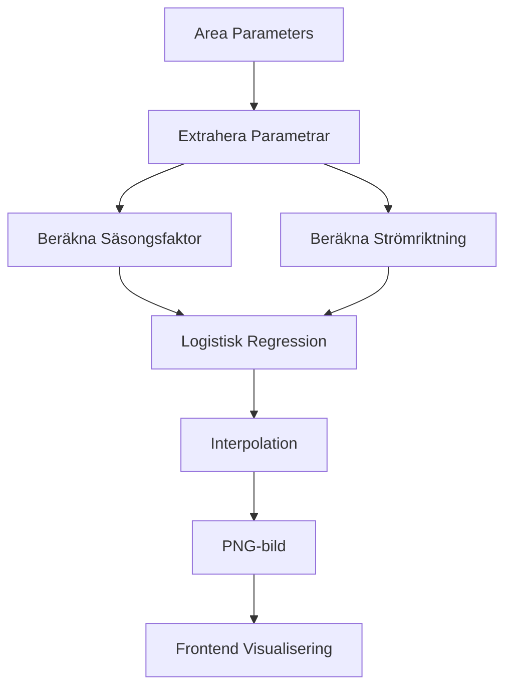

# 🐟 Makrillsannolikhet - Vetenskaplig Förutsägelse baserad på Havsparametrar

## Översikt

Makrillsannolikhetsystemet implementerar en vetenskapligt baserad logistisk regressionsmodell för att förutsäga sannolikheten för makrillförekomst baserat på havsparametrar. Systemet kombinerar temperatur, salthalt, strömstyrka, strömriktning och säsong för att ge en sannolikhet mellan 0-100%.

## 🧬 Vetenskaplig Grund

### Logistisk Regressionsformel

```
logit[P(makrill)] = β₀ + β₁·T + β₂·S + β₃·U + β₄·D + β₅·Season

P(makrill) = 1 / (1 + e^(-Z))
```

### Parametrar

- **T** = Vattentemperatur (°C) - Högre temperatur gynnar makrillförekomst
- **S** = Salthalt (g/kg) - Högre salthalt möjliggör makrillens närvaro
- **U** = Strömstyrka (m/s) - Måttlig ström är gynnsam
- **D** = Strömriktning - Sydlig ström (från norr) gynnar inflöde i Öresund
- **Season** = Säsongsfaktor - Peak på sommaren (juli-augusti)

### Förbättrade Koefficienter (med historisk data)

```python
# Huvudparametrar
β₀ = -10.0   # Grundläggande låg sannolikhet (konservativ)
β₁ = 0.5     # Temperatur (förstärkt påverkan)
β₂ = 0.2     # Salthalt (förstärkt påverkan)
β₃ = 2.5     # Strömstyrka (förstärkt påverkan)
β₄ = 3.5     # Strömriktning (kritisk för Öresund)
β₅ = 5.0     # Säsong (MYCKET kritisk - makrill är säsongsfisk!)

# Historiska faktorer (NYA!)
β₆ = 1.0     # Historisk temperatur-stabilitet
β₇ = 0.8     # Historisk salthalt-stabilitet  
β₈ = 0.6     # Historisk ström-gynnsam
```

## 🎨 Dramatisk Hotspot-Visualisering

Makrillsystemet använder en unik **sonar/radar-inspirerad** design som skiljer sig dramatiskt från andra parametrar:

- **0-20%**: Svart bakgrund - Ingen/minimal makrill
- **20-40%**: Mörkblå - Låg chans, början av aktivitet
- **40-60%**: Cyan-blå - Märkbar chans, växande aktivitet
- **60-80%**: Gul-grön - **Lysande hotspots** med hög chans
- **80-100%**: Gul-röd - **Intensiva hotspots** med optimal makrill!

### Speciella Effekter
- **Glow-effekt**: Områden >60% får extra ljus-aura
- **Kontrast**: Svart bakgrund gör hotspots mycket tydliga
- **Sonar-känsla**: Påminner om fiskesökare/sonar

## 🚀 Bildgeneration

### Grundläggande Användning

```bash
# Generera alla makrillsannolikhetsbilder
python scripts/generate_marine_images_mercator.py --parameter mackerel

# Testläge med begränsade bilder
python scripts/generate_marine_images_mercator.py --parameter mackerel --max-images 10 --force

# Hög upplösning
python scripts/generate_marine_images_mercator.py --parameter mackerel --resolution 3000
```

### Avancerade Inställningar

```bash
# Anpassad input och output
python scripts/generate_marine_images_mercator.py --parameter mackerel \
  --input public/data/area-parameters-extended.json.gz \
  --output-dir public/data \
  --water-mask public/data/scandinavian-waters.geojson \
  --resolution 2400 \
  --force
```

### Interpolationsmetod

Systemet använder samma avancerade interpolation som marina parametrar:

1. **Kubisk interpolation** - Bästa kvalitet och smoothness
2. **Linjär interpolation** - Fyller mellanområden
3. **Nearest neighbor** - Hanterar kanter
4. **Gaussian smoothing** - Naturlig övergång (σ=0.8)

## 📊 Historisk Data-Cache (7 dagar)

Systemet sparar automatiskt **7 dagars historisk data** för förbättrad precision:

### Frontend Cache (`mackerelHistoryCache.ts`)
```typescript
// Lägg till ny data till cache
addToMackerelHistory(areaData);

// Beräkna historiska medelvärden
const historical = getHistoricalAverages(lat, lon, currentTime, 72); // 3 dagar

// Statistik
const stats = getMackerelHistoryStats();
console.log(`Cache: ${stats.totalPoints} punkter, ${stats.retentionDays} dagar`);
```

### Förbättringar av Precision
- **Stabilitet**: Ihållande förhållanden över 2-3 dagar = högre sannolikhet
- **Trend-analys**: Förbättrande förhållanden = ökande chans
- **Säsongs-kontext**: Historiska data viktas baserat på säsong

## 📁 Output-struktur

```
public/data/mackerel-probability-images/
├── mackerel_probability_2025-06-29T12-00-00.000Z.png
├── mackerel_probability_2025-06-29T13-00-00.000Z.png
├── ...
└── metadata.json
```

### Metadata-struktur

```json
{
  "parameter": "mackerel_probability",
  "generated_at": "2025-01-27T...",
  "resolution": "2400x2400",
  "bbox": [10.3, 16.6, 54.9, 59.6],
  "unit": "percent",
  "range": [0, 100],
  "colormap": [...],
  "total_images": 120,
  "timestamps": [...]
}
```

## 💻 Frontend Integration

### Komponenter

1. **MackerelProbabilityLayer** - Visar sannolikhetsbilder på kartan
2. **MackerelLegend** - Visar färgskalan och parametrar

### Aktivering

Makrillsannolikheten aktiveras via ImageLayerContext:

```typescript
const { setActiveLayer } = useImageLayer();
setActiveLayer('mackerel');
```

### Preloading

Systemet preloads bilder för smooth övergångar:

```typescript
console.log('🐟 Bakgrundspreloading av makrillbilder...');
// Bilder laddas gradvis i bakgrunden
```

## 🎯 Praktisk Användning

### Optimala Förhållanden

Högsta sannolikhet för makrill erhålls när:

- **Temperatur**: >15°C (sommarvärme)
- **Salthalt**: >20 g/kg (oceaniskt vatten)
- **Ström**: Måttlig styrka (0.2-0.8 m/s)
- **Riktning**: Sydlig (från Kattegatt in i Öresund)
- **Säsong**: Juli-augusti (högsäsong)

### Regionala Skillnader

- **Västkusten**: Hög salthalt ger grundläggande hög sannolikhet
- **Öresund**: Strömriktning avgörande för saltvatteninflöde
- **Östersjön**: Salthalt begränsande faktor

## 🔬 Validering och Kalibrering

### Historisk Data

I praktiken skulle koefficienterna tränas på:
- Historiska fångstdata
- Observationer av makrillavstim
- Rapporter från fiskare
- Vetenskapliga undersökningar

### Kontinuerlig Förbättring

Nuvarande koefficienter är **estimerade** baserat på ekologisk kunskap. För verklig användning skulle de **tränas** på faktisk data:

```python
# 1. Samla verklig fångstdata
fishing_data = [
    {"date": "2024-07-15", "lat": 56.0, "lon": 12.6, "good_catch": True, 
     "temp": 18.5, "salinity": 25.2, "current_u": 0.3, "current_v": -0.2},
    {"date": "2024-07-16", "lat": 56.1, "lon": 12.7, "good_catch": False, 
     "temp": 17.2, "salinity": 22.1, "current_u": 0.1, "current_v": 0.1},
    # Hundratals/tusentals observationer från fiskare, forskare etc.
]

# 2. Träna logistisk regression på verklig data
from sklearn.linear_model import LogisticRegression

# Förbered features: [temp, salinity, current_strength, direction_factor, season]
X = prepare_features(fishing_data)
y = [entry["good_catch"] for entry in fishing_data]

# Träna modellen
model = LogisticRegression()
model.fit(X, y)

# 3. Extrahera "verkliga" kalibrerade koefficienter
β0 = model.intercept_[0]
β1, β2, β3, β4, β5 = model.coef_[0]

print(f"Tränade koefficienter: β0={β0:.2f}, β1={β1:.2f}, ...")
```

### Datakällor för Träning
- **Fiskare-rapporter**: Fångst-dagböcker från lokala fiskare
- **Forskningsexpeditioner**: Vetenskapliga undersökningar av makrill
- **Fiskemarknader**: Data från kommersiella landningar
- **Sportfiske-appar**: Crowdsourced data från sportfiskare

## 🌊 Dataflöde



## 📊 Prestanda

### Beräkningstid

- **Bildgeneration**: ~2-5 sekunder per bild
- **Interpolation**: Optimerad för 2400x2400 grid
- **Preloading**: Gradvis bakgrundsladdning

### Minnesanvändning

- **Smoothing**: σ=0.8 för naturliga övergångar
- **Cache**: Preloaded bilder för instant växling
- **Optimering**: Chunked processing för stora dataset

## 🛠️ Felsökning

### Vanliga Problem

1. **Ingen metadata**: Kör bildgeneration först
2. **Låg sannolikhet**: Kontrollera säsong och parametrar
3. **Bildfel**: Kontrollera vattenmask och bbox

### Debug-info

```javascript
console.log('🐟 Makrill debug:', {
  parameter: 'mackerel_probability',
  unit: 'percent',
  range: [0, 100],
  current_image: 'mackerel_probability_2025-06-29T12-00-00.000Z.png'
});
```

## 🔮 Framtida Utveckling

### Möjliga Förbättringar

1. **Historisk Data**: Inkludera 2-3 dagars medelvärden
2. **Biologiska Parametrar**: Planktonkoncentration, siktdjup
3. **Vind**: Indirekt påverkan på strömmar och ytvatten
4. **Dygnsrytm**: Gryning/skymning påverkan
5. **Födotillgång**: Sill- och skarpsillsförekomst

### Maskininlärning

```python
# Framtida implementering med Random Forest
from sklearn.ensemble import RandomForestClassifier

# Träna avancerad modell
rf = RandomForestClassifier(n_estimators=100)
rf.fit(expanded_features, outcomes)

# Extrahera viktiga parametrar
feature_importance = rf.feature_importances_
```

## 📈 Resultat

Systemet ger:
- **Vetenskapligt baserade** prognoser
- **Intuitiv visualisering** med färgskala
- **Realtidsuppdateringar** baserat på aktuella parametrar
- **Optimala fiskeplatser** för makrill

Använd makrillsannolikheten för att optimera fiskechanserna och hitta de bästa platserna baserat på aktuella havsförhållanden! 